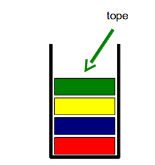
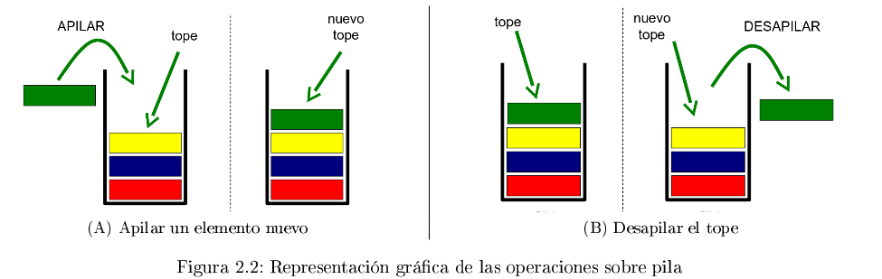

# Estructura de Datos

## indice:

[TOC]


## Pila

Una pila es una estructura de estilo LIFO(Last in, Fist out),  lo que quiere decir que el primero en entrar es el  primero en salir. La comparacion mas mundana es como una pila de platos, donde los apilamos uno encima de otro, y el ultimo apilado es el primero en salir. 

Podemos identificar que el dato que vamos a operar (apilar, desapilar) es el *tope* de la pila. Es el unico elemento visible en la estructura, ya que es el unico que se apilo, y desapilo.




Podemos identifica dos operaciones primordiales en la estructura, apilar: donde metemos un cosa en el tope de la pila, y desapilar: donde sacamos el tope de la pila.

¿que pasa si saco el ultimo plato de una pila de platos?¿cual es el tope ahora?

las pilas funcionan para una variedad de problemas donde tenemos que "volver a una operacion anterior" (volver atras en una pagina web, el amado Ctrl-z en cual no desace cambios efectudos en cualquier editor de texto). utilizaremos la pila cuando necesitamos obtener el orden inverso al que fueron agregados por ejemplo invertir un numero, o una cadena de texto.

## Interfaz de una pila

operaciones:

- constructor vacío
  // Crea y devuelve la pila vacía.
  
- apilar (nuevoElem):boolean
  // Pone el elemento nuevoElem en el tope de la pila. Devuelve verdadero
  si el elemento se pudo apilar y falso en caso contrario.
  
- desapilar():boolean
  // Saca el elemento del tope de la pila. Devuelve falso si la pila esta vacia
  
- obtenerTope() : elem
  // Devuelve el elemento en el tope de la pila.
  
- esVacia() : boolean
  // Devuelve verdadero en caso de que la pila este vacia
  
- vaciar():void

  //vacia la pila

- clone():Pila

  //Devuelve una copia exacta de los datos en la estructura original, y respetando el orden de los mismos, en otra estructura del mismo tipo

- toString():String

  //Devuelve una cadena de caracteres enlistando los elmenetos en el orden en el que fuerno apilados

### el UML de la clase pila

---

PIla

---

-TAMANIO: int

-arreglo: array[0,...,TAMANIO-1] de tipoObjeto/Elemento

-tope:int = -1

---

+Pila()

+apilar(TipoElemento):boolean

+desapila():boolean

+obtenerTope():TipoElemento

+esVacia():boolean

+vaciar()

+clone():Pila

+toString():String

---

## Implementacion Estatica de pila

En esta implementacion vamos a definir un espacio de memoria fijo con el cual vamos a trabajar. en el caso de java definimos esta longitud fija con un arreglo. por el principio de encapsulacion podemos definir que estos arreglos y variables para conocer el estado de la pila(vacia y llana) no pudan ser acceddidos.

```java
public class Pila{
	private Object[] arreglo;
	private int tope;
	private int TAMANIO;
	
	public Pila(int longitud){
		this.arreglo = new Object[longitud];
		this.tope = -1;
	}
}
```

de esta forma declaramos la pila y la construimos, donde le definimos el tope de la pila, esto combiene para poder probar la pila, en una implementacion de pila estatica tenemos que definirla ocultando el tamaño de la pila. en caso de que la persona sobrepase la pila devolvemos el erro *stackOverflow* o desbordamiento de pila.

### implementacion apilar

```java
public boolean apilar(Object elemento){
	boolean retorno = false;
    //si no esta llena
    if(this.tope < this.TAMANIO - 1){
        this.tope++;
        this.arreglo[this.tope] = elemento;
        retorno = true;
    }
	//retornamos true en caso de poder apilar en caso contrario no apilo 
    return retorno;
}
```

En esta implementacion tenemos que apilar un elemento en el tipe de la pila, por lo cual tenemos que evaluar si la pila no esta llena, *tope* guarda el lugar del arreglo donde esta el tope. La condion se llena si: 
$$
tope = array.length()-1
$$
osea esta en la ultima pocicion. en ese caso no apila. En caso de que no este llena imcrementa el *tope* y guarda el valor del parametro en esa pocicion. Por ultimo retorna true.

## implementacion desapilar

```java
public boolean desapilar(){
	boolean retorno = false;
    //verificamos si la estructura no esta vacia
    if(this.tope > -1){
        this.arreglo[this.tope] = null;
        this.tope--;
        retorno = true;
    }
}
```

En este caso si la pila esta vacia retorna falso.  si no lo esta lo que esta en el tope se *desreferecia* y el *Garbage Collector* o como lo llamo *pacman de java* se come esa memoria no usada nadie lo referencia a ese elemento.  luego diminuimos el tope, por ultimo retornamos verdadero.

### implementacion tope

```java
public Object obtenerTope(){
	Object retorno = null;
    //verificamos que no tengamos la pilaVacia
    if(esVacia()){
        retorno = this.arreglo[this.tope];
    }
    return retorno;
}
```

retornamos el elemento tope de la pila. en caso de que este vacia devolvemos el elemento *nulo*. el modulo esVacia es un metodo que implementaremos ahora

### implementacion esVacia

```java
public boolean esVacia(){
	boolean retorno = true;
    if(this.tope > -1){
        retorno = false;
    }
    return retorno;
}
```

en caso de que el tope sea -1 retorna verdadero en caso contrario retorna falso

### implementacion vaciar

```java
//metodo 1
public void vaciar(){
	int i = this.tope;
    while(i > -1){
        this.arreglo[i] = null;
        i++;
    }
    this.tope = -1;
}

//metodo 2
public void vaciar2(){
    //como un arreglo es una estructura la desreferenciamos
    this.arreglo = null;
    //y referenciamos a una nueva
    this.arreglo = new Object[this.TANANIO];
    this.tope = -1;
}
```

Cualquiera de estos metodos vacian el arreglo de la pila y resetean el tope a -1. 

## implementacion clon

``` java
//metodo iterativo 1
public Pila clon(){
	//creamos la nueva pila y comenzamos a operar
    Pila clon = new Pila(this.TAMANIO);
    int i = 0;
    
    while(i <= this.tope){
        clon.arreglo[i] = this.arreglo[i];
        i++;
    }
    return clon;
}

//metodo iterativo 2
public Pila clon2(){
	//creamos la nueva pila y comenzamos a operar
    Pila clon = new Pila(this.TAMANIO);
    int i = 0;
    //apilamos usando los metodos del objeto
    while(i <= this.tope){
        clon.apilar(this.arreglo[i]);
        i++;
    }
    return clon;
}

//metodo recursivo
public Pila clon3(){
    //creamos una nueva pila
    Pila clon = new Pila(this.TAMANIO);
    clonPasoRecursivo(clon, this.tope);
	return clon;
}

//metodo recursivo para apilar
private void clonPasoRecursivo(Pila clon, int topeActual){
    //nos mo movemos por la pila original desde el tope hacia abajo
    if(topeActual > -1){
        //vamos disminuyendo el tope asta que este sea -1
        clonPasoRecursivo(clon, topeActual - 1);
        //cuando salimos apilamos en el clon
        clon.apilar(this.arreglo[topeActual]);
    }
}
```

en este caso devolvemos la referencia de de la pila creada. tenemos dos metodos iterativos. el primero asigana los elementos de un arreglo(original) a otro(clon) usando una variable iteradora que va de 0 al tope. la segunda usa el metodo apilar, para ir apilando lo que hay en el arreglo del original usando de nuevo una variable iteradora asta el tope.

El metoro recusivo usa un paso, el cual se le ingresa la referencia del clon, luego decrementamos una variable tope asta el caso base(pila vacia o tope = -1) en este caso sale. cuando sale lo que este en esa pocision es apilado en el clon. 

### implementacion de toString

```java
public String toString(){
	String retorno = "[";
    int i = 0;
    
    if(i <= this.tope){
        retorno = retorno + this.arreglo[i].toString;
        i++;
        if(i <= this.tope){
            retorno = retorno + ",";
        }
    }
    
    retorno = retorno + "]";
}
```

comanzamos en la base de la pila, concatenando el valor de cada uno de los elementos almacenados, lo que podemos hacer son dos metodos uno usa el *toString* (sobrescribiendo el metodo de toString de la clase Object) de cada elemento.