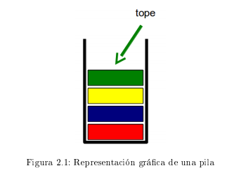
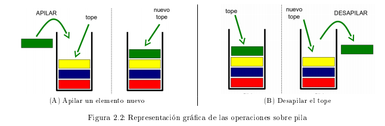

# Lineales

Estas estructuras son las principales y las más intuitivas a la hora de representar y almacenar información. Almacenan datos de forma lineal, esto es uno después que la otro. por lo que se forman una fila de información. en estas estructuras hay algunas diferencias en cuanto a cómo se recupera dicha información y de cómo se almacena.

## Pila

Esta estructura es una de tipo LIFO (Last In, First Out). el último elemento es el primero en salir como en las torres de hanoi o una pila de platos. Por lo que tendremos que representar este tipo de control para solo poder sacar el primer elemento.

Como podemos ver en la figura 2.1 tenemos una variable tope que apunta al último elemento almacenado. tendremos dos operaciones principales *apilar* y *desapilar* . donde apilar coloca un nuevo elemento en el tope, y desapilar saca el elemento del tope y asigna este al que está inmediatamente por debajo.

Las pilas son utilizadas para solucionar una amplia variedad de problemas en compiladores, sistemas operativos y otros programas en general. Un ejemplo de este tipo de software son los navegadores de Internet: Los browsers usan una pila para almacenar las direcciones de los sitios recientemente visitados y así implementar la funcionalidad "volver atrás" (backspace). También los editores de texto, que proporcionan normalmente un botón deshacer que cancela las operaciones de edición recientes en el orden inverso al que fueron hechas. Otro uso común es la pila de recursividad, en donde en cada llamado recursivo se apilan los valores de los parámetros y variables de ese llamado. En general, utilizaremos pilas cada vez que necesitemos recuperar los elementos en el orden inverso al que han sido agregados.

### Operaciones del TDA Pila

- constructor vacío

  // Crea y devuelve la pila vacía. 

- apilar (nuevoElem):boolean 

  // Pone el elemento nuevoElem en el tope de la pila. Devuelve verdadero si el elemento se pudo apilar y falso en caso contrario. 

- desapilar():boolean 

  // Saca el elemento del tope de la pila. Devuelve verdadero si la pila no estaba vacía al momento de desapilar (es decir que se pudo desapilar) y falso en caso contrario. 

- obtenerTope() : elem 

  // Devuelve el elemento en el tope de la pila. Precondición: la pila no está vacía. 

- esVacia() : boolean

  // Devuelve verdadero si la pila no tiene elementos y falso en caso contrario. 

- vaciar() : void 

  // Saca todos los elementos de la pila. 

- clone() : Pila 

  // Devuelve una copia exacta de los datos en la estructura original, y respetando el orden de los mismos, en otra estructura del mismo tipo 

- toString() : String

  // Devuelve una cadena de caracteres formada por todos los elementos de la pila para poder mostrarla por pantalla. Es recomendable utilizar este método únicamente en la etapa de prueba y luego comentar el código.

### Implementacion

veremos cómo implementar esta estructura de manera estática y de manera dinámica, en la primera almacenamos espacio de memoria por lo cual solo podremos opinar de forma finita, en la segunda la memoria es almacenada de forma dinámica, por lo que podremos opinar de forma indefinida.

#### Estatica

